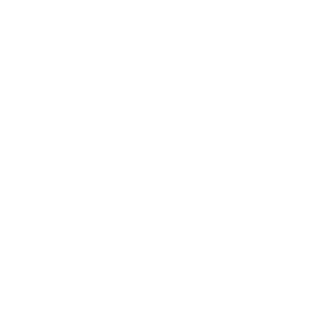

<p align="center"></p>

# Checker-App

WEB приложение созданное для проведения соревнований AltayCTF-School в формате Task-based;

##  Technologies Used

[PHP](https://www.php.net/) - Язык программироваия.

[Composer](https://getcomposer.org/) - Менеджер зависимостей для PHP.

[Docker](https://www.docker.com/) - Контейнеризация.

[NodeJS](https://nodejs.org/en) - NodeJS.

[Laravel](https://laravel.com/docs) - Фреймворк.

[Laravel Sail](https://laravel.su/docs/10.x/sail) - Взаимодействия со средой разработки Docker.

[Laravel Reverb](https://laravel.su/docs/10.x/reverb) - WebSocket.

##  Installation (Linux Debian)

#### PHP: 
```
sudo apt update
sudo apt install php
```
#### Composer: 
```
sudo apt-get install php-curl
curl -sS https://getcomposer.org/installer -o composer-setup.php
sudo php composer-setup.php --install-dir=/usr/local/bin --filename=composer
```
#### Docker:
```
sudo apt update
sudo apt install -y docker.io
sudo systemctl enable docker --now
sudo usermod -aG docker $USER
echo "deb [arch=amd64 signed-by=/etc/apt/keyrings/docker.gpg] https://download.docker.com/linux/debian bookworm stable" | \
  sudo tee /etc/apt/sources.list.d/docker.list
curl -fsSL https://download.docker.com/linux/debian/gpg |
  sudo gpg --dearmor -o /etc/apt/keyrings/docker.gpg
sudo apt update
sudo apt install -y docker-ce docker-ce-cli containerd.io
```

#### NodeJs:
```
curl -o- https://raw.githubusercontent.com/nvm-sh/nvm/v0.40.0/install.sh | bash
nvm install 22
```

##  Launch
#### Checker-App(В дирректории проекта):
> [!WARNING]
> Во время выполнения следующих 3-х комманд при появлении ошибок ничего не предпринимать!
```
sudo apt update
composer update
composer install
```
В дирректории проекта создать файл `.env` и скопировать в него содержимое `.env.example` (чтобы увидеть этот файл нажмите Ctrl + H)

и в файле `.env` изменить `REVERB_HOST="your_ip_address"`. Вместо `your_ip_address` свой IPv4 адрес. (узнать его можно командой `ip a`)

Создайте необходимые дирректории:
```
cd storage/
mkdir -p framework/{sessions,views,cache}
mkdir -p app/{public,sql_dump,public/teamlogo}
chmod -R 755 framework
chmod -R 755 app
cd ..
cp public/media/img/StandartLogo.png storage/app/public/teamlogo
```

Выполните сборку приложени:
```
npm install
npm run build
```

Для запуска приложения нужно открыть консоль в дирректории проекта, вставить все эти команды одновременно и дождаться их выполнения:
```
./vendor/bin/sail up --build -d
sleep 20
./vendor/bin/sail restart
sleep 20
./vendor/bin/sail artisan migrate
./vendor/bin/sail artisan migrate:fresh --seed
./vendor/bin/sail artisan storage:link
sleep 20
./vendor/bin/sail restart
echo "Установка Завершена"
```
Чтобы узнать, что все работает, откройте браузер и перейдите к localhost, вы должны увидеть страницу авторизации.

#### Далее для работы с Checker-App используйте следующие команды:

Чтобы запустить все контейнеры Docker в фоновом режиме введите команду:
```
./vendor/bin/sail up -d
```
Чтобы остановить все контейнеры Docker введите команду:
```
./vendor/bin/sail stop
```
Чтобы перезапустить все контейнеры Docker введите команду:
```
./vendor/bin/sail restart
```
##  Helper
- [Возможные решения при появлении ошибок](ISSUES.md)
##  Useful Things
#### Пароль от Администратора
находится в файле `.env` и при каждом запуске вашего приложения сохраняется в таблице admins.
> [!WARNING]
> Имя администратора в базе данных изменять нельзя! только для продвинутых пользователей!
#### Для удобного переноса данных с одного устройства на другое предусмотрено сохранение и загрузка базы данных.

```./vendor/bin/sail artisan dumb:db-export``` - сохранение

```./vendor/bin/sail artisan dump:db-import``` - загрузка
#### Миграции
При использовании миграций laravel использовать команду:

```
./vendor/bin/sail artisan migrate:fresh --seed
```
чтобы произошла начальная загрузка данных в главные таблицы, либо используйте dump базы данных и команды приведенные выше.
