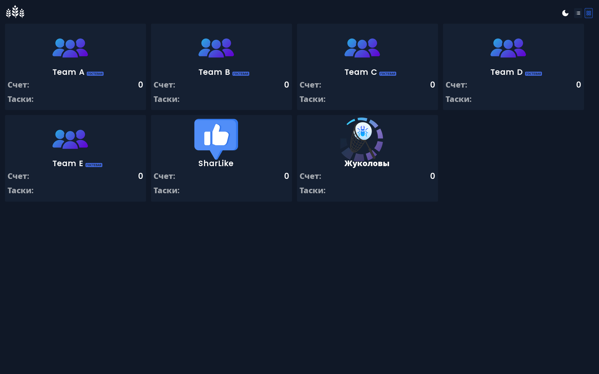
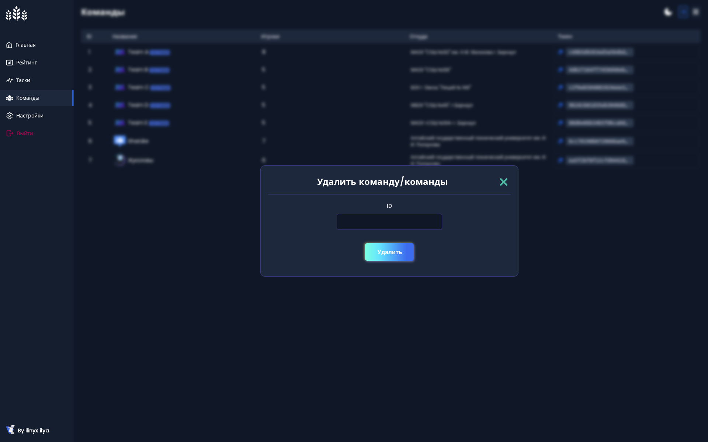

<p align="center"></p><a id='links'></a>

# <p align="center">Jury-App</p>

### <p align="center">Журийная система для соревнований CTF в формате Task-based</p>

##  Ссылки
### [Технологии](#technologies) | [Описание](#description) | [Установка](#download) | [Инициализация](#init)
### [Использование](#using) | [Помощь](#help) | [Галерея](#galery)

##  <a id='technologies'></a> Используемые технологии [](#links)

[PHP](https://www.php.net/) - Язык программироваия.

[Composer](https://getcomposer.org/) - Менеджер зависимостей для PHP.

[Docker](https://www.docker.com/) - Контейнеризация.

[Laravel](https://laravel.com/docs) - Фреймворк.

[Laravel Sail](https://laravel.su/docs/10.x/sail) - Docker-интерфейс.

[Laravel Reverb](https://laravel.su/docs/10.x/reverb) - WebSocket.

##  Описание <a id='description'></a>[](#links)

#### Платформа представляет собой специализированный ресурс для организации и проведения CTF-соревнований в task-based формате. 
#### Основное функциональное назначение системы включает четыре ключевых аспекта: 
- Создание и администрирование CTF-заданий, 
- Мониторинг решенных заданий, 
- Визуализацию рейтинговой системы и статистических данных, 
- Управление пользовательскими аккаунтами.

### Основные сущности

- **Пользователи**
- **Команды**
- **Задания**
- **Решенные задания**

### Связи между сущностями

- Команды → много решенных заданий
- Решенное задание → много команд

### Технические особенности
- **Json-ответы сервера**
- **Веб-сокеты**
- **Валидация в Requests**
##  <a id='download'></a> Установка (Linux Debian) [](#links)

> [!WARNING]
>  Фреймворк Laravel имеет несколько системных требований.
>  Вы должны убедиться, что ваш веб-сервер имеет следующую минимальную версию PHP и расширения:
> - PHP >= 8.2
> - Расширение PHP Ctype
> - Расширение PHP cURL
> - Расширение PHP DOM
> - Расширение PHP Fileinfo
> - Расширение PHP Filter
> - Расширение PHP Hash
> - Расширение PHP Mbstring
> - Расширение PHP OpenSSL
> - Расширение PHP PCRE
> - Расширение PHP PDO
> - Расширение PHP Session
> - Расширение PHP Tokenizer
> - Расширение PHP XML
>
> Это все нужно для установки необходимых зависимостией!

#### PHP: 
```
sudo apt update
sudo apt install php
```
#### Зависимости PHP:
```
sudo apt update
sudo apt install php-ctype php-curl php-dom php-fileinfo php-filter php-hash php-mbstring php-openssl php-pcre php-pdo php-session php-tokenizer php-xml
```
#### Composer: 
```
sudo apt-get install php-curl
curl -sS https://getcomposer.org/installer -o composer-setup.php
sudo php composer-setup.php --install-dir=/usr/local/bin --filename=composer
```
#### Docker:
```
sudo apt update
sudo apt install -y docker.io
sudo systemctl enable docker --now
sudo usermod -aG docker $USER
echo "deb [arch=amd64 signed-by=/etc/apt/keyrings/docker.gpg] https://download.docker.com/linux/debian bookworm stable" | \
  sudo tee /etc/apt/sources.list.d/docker.list
curl -fsSL https://download.docker.com/linux/debian/gpg |
  sudo gpg --dearmor -o /etc/apt/keyrings/docker.gpg
sudo apt update
sudo apt install -y docker-ce docker-ce-cli containerd.io
```

#### NodeJs:
```
curl -o- https://raw.githubusercontent.com/nvm-sh/nvm/v0.40.0/install.sh | bash
nvm install 22
```

##  <a id='init'></a> Инициализация [](#links)
#### Jury-App(В дирректории проекта):
> [!WARNING]
> Скрипт launch.sh находится в разработке, здесь представлена Alpha версия, использовать с осторожностью!

> [!NOTE]
> Рекомендуется установить DNS 8.8.8.8 - чтобы не было проблем со сборкой контейнеров!

Скопируйте Production версию в docker-compose:
```bash
cp docker/production/docker-compose.prod.yml docker-compose.yml
```
Чтобы автоматически создать все необходимые таблицы базы данных, раскоментируйте строчку в docker-compose:
```
- './database/schema/init.sql:/docker-entrypoint-initdb.d/dump.sql'
```

```
sudo apt update
composer update
composer install
```
В дирректории проекта создать файл `.env` и скопировать в него содержимое `.env.example` (чтобы увидеть этот файл нажмите Ctrl + H)

Выполните сборку приложени:
```
npm install
npm run build
```

Для запуска приложения нужно открыть консоль в дирректории проекта, вставить все эти команды одновременно и дождаться их выполнения:
```
 docker compose exec app up --build -d
 docker compose exec app artisan migrate --seed
```

Генерация ключа
```
docker compose exec app php artisan key:generate
```
Чтобы узнать, что все работает, откройте браузер и перейдите к `localhost:80`,и вы должны увидеть страницу авторизации.

##  <a id='using'></a> Использование [](#links)
#### Пароль от Администратора
находится в файле `.env` и хрнаится в таблице admins в хешированном виде.
> [!WARNING]
> Имя администратора в базе данных изменять нельзя! только для продвинутых пользователей!

#### Для удобного переноса данных с одного устройства на другое предусмотрено сохранение и загрузка базы данных.

``` docker compose exec app artisan dumb:db-export``` - сохранение дампа базы.

``` docker compose exec app artisan dump:db-import``` - загрузка дампа базы.

``` docker compose exec app artisan dump``` - просмотр документации.
#### Миграции
При использовании миграций laravel использовать команду:

```
 docker compose exec app artisan migrate --seed
```

##  <a id='help'></a> Помощь [](#links)
- ### [Возможные решения при появлении ошибок](ISSUES.md)

##  <a id='galery'></a> Галерея [](#links)

### Гости:




### Команды(авторизованные пользователи):


### Администраторы:





[](#links)
